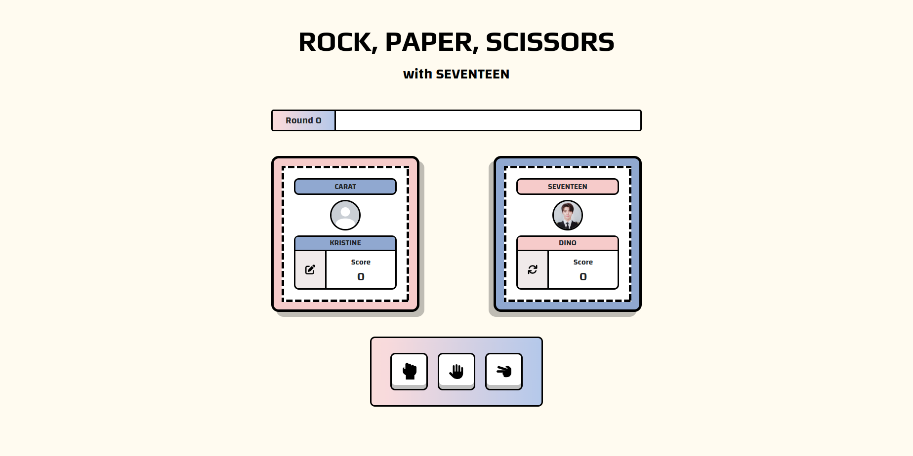
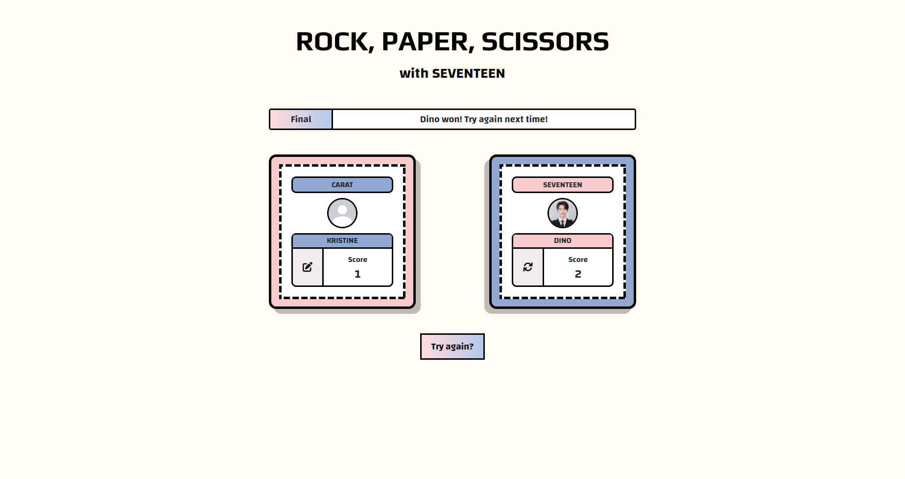

# Odin Rock, Paper, Scissors Projects

## About

A self-indulgent rock, paper, scissors game. The usual rules applies to this game, but to make it fun, instead of playing with just the "computer", I made it seem like I'm playing with SEVENTEEN (a k-pop boy group). Each click on the reload button inside the SEVENTEEN card would randomly switch player 2's name and image to each SEVENTEEN's member. When the pen-to-square button is clicked inside the carat card, a prompt will pop-up, then player 1's name will change.

## Screenshot

## References

SEVENTEEN Images Source: https://www.pinterest.ph/ch_zzy/
